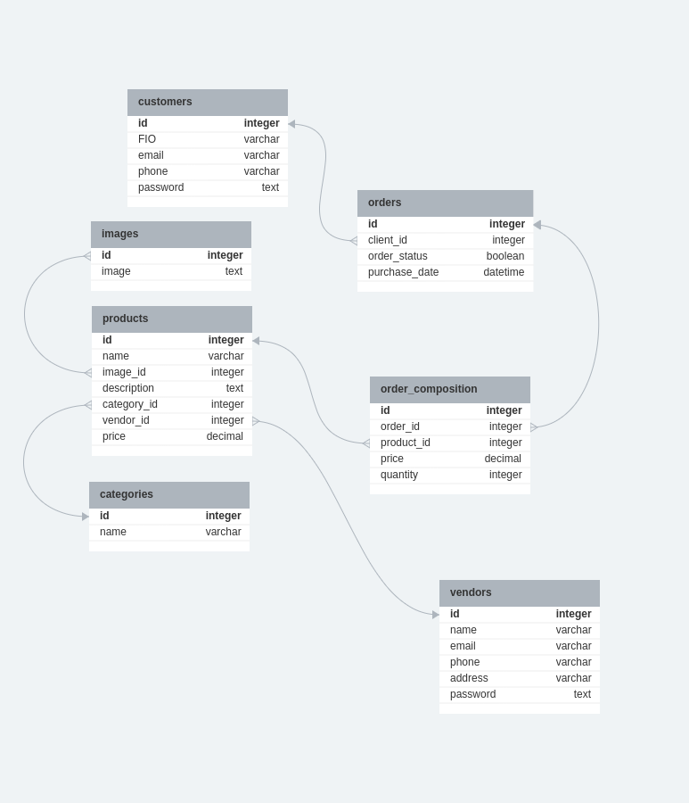
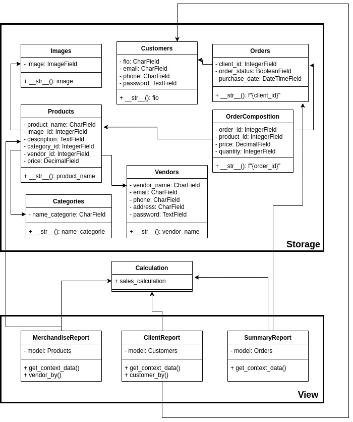
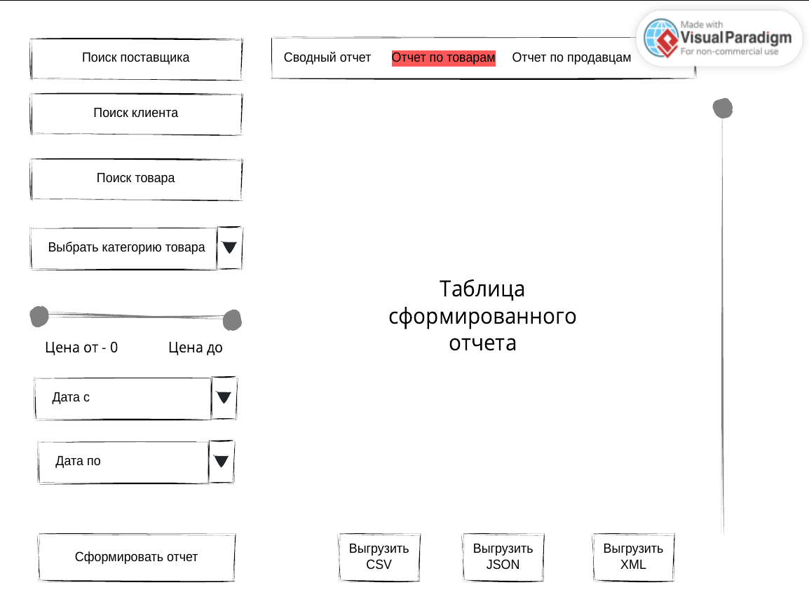

ERD диаграмма

    products {
        id integer pk increments
        name varchar(150)
        image_id integer *>* images.id
        description text
        category_id integer *> categories.id
        vendor_id integer *> vendors.id
        price decimal
    }
    
    categories {
        id integer pk increments
        name varchar(20)
    }
    
    images {
        id integer pk increments
        image text
    }
    
    orders {
        id integer pk increments
        client_id integer(60) *> customers.id
        order_status boolean
        purchase_date datetime
    }
    
    order_composition {
        id integer pk increments
        order_id integer *> orders.id
        product_id integer *> products.id
        price decimal
        quantity integer
    }
    
    vendors {
        id integer pk increments
        name varchar(250)
        email varchar(50)
        phone varchar(20)
        address varchar(250)
        password text
    }
    
    customers {
        id integer pk increments
        FIO varchar(50)
        email varchar(30)
        phone varchar(20)
        password text
    }

UML диаграмма

Интерфейс
